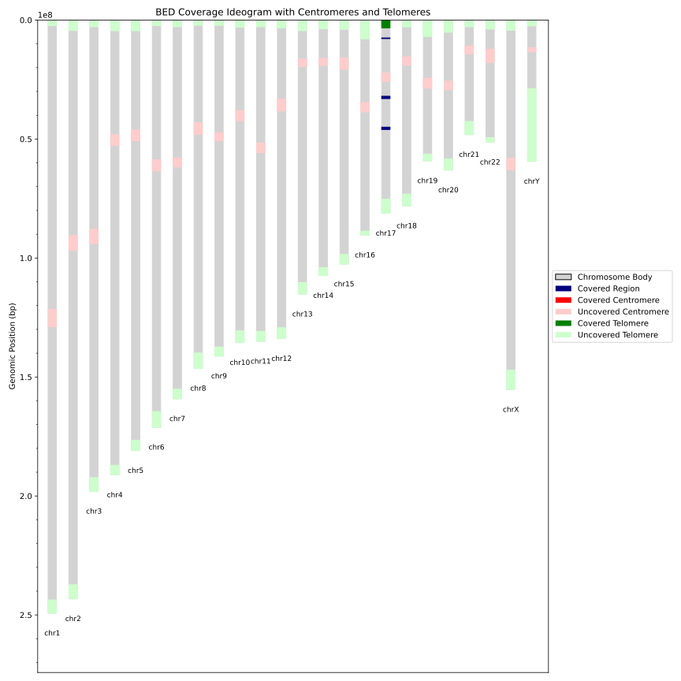
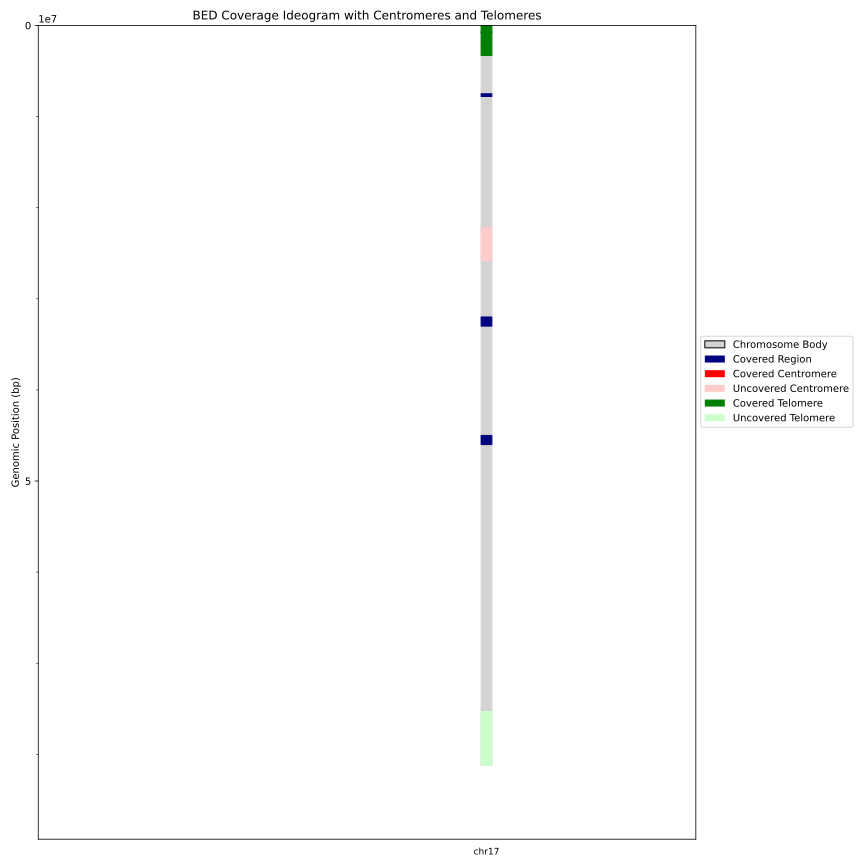

# IdeoCoverage

🧬 **IdeoCoverage** is a Python-based tool for visualizing chromosome ideograms with integrated coverage information from BED files. It highlights centromeric and telomeric regions using cytoband annotations and shows whether these critical genomic features are covered or not.

---

## ✨ Features

- Draws **scaled chromosome ideograms** (chr1–22, X, Y)
- Highlights:
  - 🟥 Covered / Uncovered **centromeres**
  - 🟩 Covered / Uncovered **telomeres**
  - 🔷 **BED coverage** regions
- Uses **cytoband files** to annotate centromeres and telomeric regions
- Generates high-resolution **SVG plots**
- Adds minor ticks and a clean legend for publication-quality visuals

---

## 🛠️ Requirements

- Python 3.7+
- Packages:
  - `matplotlib`
  - `pandas`
  - `pybedtools` # needs bedtools installed on your system (for pybedtools to work)
  - `pyfaidx`

Install dependencies:

```bash
pip install -r requirements.txt
```

## 📦 Usage
```
python3 coverage_ideogram.py \
    --fasta path/to/reference.fasta \
    --bed path/to/regions.bed \
    --cytoband path/to/cytoBand.txt \
    --output coverage_ideogram.svg
```
### Example
```
python3 coverage_ideogram.py \
    --fasta hg19.fa \
    --bed example.bed \
    --cytoband cytoBand.txt \
    --output ideogram_output.svg
```


## ✅ Inputs

| Argument   | Description  |
|------------|--------------|
| `--fasta`  | Reference genome FASTA file (like `hg19.fasta`)  |
| `--bed`    | BED file containing regions of interest (like `regions.bed`)  |
| `--cytoband` | Cytoband annotation file (UCSC-style `hg19_cytoBand.txt`)  |
| `--output` | Output image filename (recommended: `.svg`)  |

## 🖼️ Example Output
- When full fasta file is provided:
<p align="center">  </p>

- When specific chromosome fasta file is provided:
<p align="center">  </p>

## 🌐 Cytoband Files

You can download a cytoband file from the UCSC Table Browser:

- [cytoBand.txt for hg19](http://hgdownload.cse.ucsc.edu/goldenPath/hg19/database/cytoBand.txt.gz)
- [cytoBand.txt for hg38](http://hgdownload.cse.ucsc.edu/goldenPath/hg38/database/cytoBand.txt.gz)

## 🙏 Acknowledgements
- **[UCSC Genome Browser](https://genome.ucsc.edu/)** — for cytoband annotations
- **pyfaidx** — for efficient FASTA file parsing
- **pybedtools** — for BED file manipulation
- **matplotlib** — for visualization
- **pandas** — for data handling

## 📜 License
This project is licensed under the [MIT License](LICENSE).
